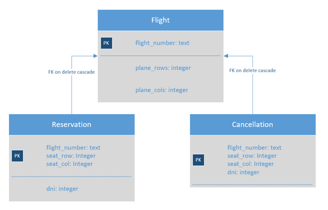

# Flights - Daniella Liberman
Sistema cliente-servidor para reserva de asientos de aviones implementado utilizando sockets

## Introducción
En este documento se explican los detalles de implementación y diseño del TP3. También se mencionan los problemas encontrados a lo largo del desarrollo y las decisiones tomadas respecto a ellos.

## Servidor Multiproceso
A la hora de implementar el Servidor, como el enunciado pedía hacerlo concurrente, tenía dos opciones:
Que sea multithread o multiprocess. Opté por la segunda, por las siguientes razones:
-	Al no compartir recursos, se reduce la posibilidad de bugs.
-	Es más seguro porque cada cliente tiene su proceso (y su espacio de memoria) y por lo tanto es más difícil que un cliente acceda a la memoria de otro.
-	En Linux no hay mucha diferencia en cuanto a performance del sistema entre el uso de threads o procesos.

Para tomar esta decisión los siguientes links fueron de ayuda:
https://cs.nyu.edu/courses/fall13/CSCI-UA.0201-003/lecture26.pdf
https://stackoverflow.com/a/9700728

Para lograr un Servidor multiproceso, lo que hice fue: Cada vez que se acepta un cliente, el proceso “listener” forkea, dejando a su hijo encargado del nuevo cliente y él vuelve a escuchar. Para no sobrecargar al sistema, con el semáforo CHILD_SEM limité la cantidad de clientes que pueden ser servidos al mismo tiempo. La cantidad máxima de clientes está dada por la constante definida como MAX_CHILD_PROCESSES en utils/utils.h.
Links utilizados para aprender acerca de sockets:
https://www.freebsd.org/doc/en/books/developers-handbook/sockets.html
https://www.youtube.com/watch?v=aj8S62TDzRg

## Servidor Daemon
Creí conveniente la posibilidad de correr un servidor daemon, para que éste corra background, liberando la terminal. Para poder correrlo de esta forma se debe indicar utilizando el argumento -d
```
$> ./server -d
```
Esta funcionalidad la hice opcional porque para hacer pruebas quizás es conveniente tener el servidor ocupando una terminal. De lo contrario, se debe terminar el servidor mediante
```
$> kill <pid_del_server>
```
Cuando se corre como daemon, se redirecciona la salida estándar a un archivo log.txt, de forma tal que todos los mensajes, tanto de error como de OK, se envían a este archivo. Cada vez que se corre un server daemon, se escribe en el archivo el texto “server started:” seguido de la fecha y la hora en la que se abrió. Esto sirve para llevar un registro de lo sucedido. Para esto último utilicé un código extraído del siguiente link: https://stackoverflow.com/questions/29154056/redirect-stdout-to-a-file

## Wait de los procesos hijos
Para evitar que los procesos hijos (los que atienden a cada cliente) queden zombies, cuando éstos finalizan debe ejecutarse wait en el padre (el proceso listener). Si esto se hace apenas se crea el hijo, el padre no podría seguir escuchando otros clientes, y el servidor dejaría de ser concurrente. Por esto, opté por crear un handler para la señal SIGCHLD, la cual se envía cada vez que un hijo finaliza. Esta función sigchld_handler(…) lo que hace es hacer wait de aquellos hijos que terminaron. Para esto utilicé el link: https://cs.nyu.edu/courses/fall13/CSCI-UA.0201-003/lecture26.pdf


## Cierre de los semáforos
Esto debe hacerse cuando el servidor termina su ejecución. Para lograrlo, cree una función close_handler(…) la cual se ejecuta ante las posibles señales de finalización del programa: SIGINT, SIGQUIT, SIGTERM.

## Estructura de Archivos
El trabajo está dividido en dos partes principales: Cliente y Servidor. Estos se comunican utilizando el protocolo. Por esto se encuentran estas tres carpetas.
Dentro de client se encuentran:
-	**actions**: Contiene todas las funciones que puede realizar el cliente (obtener estado de vuelo, etc).
-	**frontend**: Tiene todas aquellas funciones que se encargan de pedir y mostrar datos al usuario.
-	**client.c**: Utiliza las funciones de actions y frontend.
Por otra parte, dentro de server, se encuentran:
-	**actions**: Contiene todas las funciones que puede realizar el servidor.
-	**database**: Provee todas las funcionalidades necesarias de la base de datos.
-	**flights.db**: Es el archivo en el cual se guardan los datos de la db.
-	**log**: Contiene funciones para mostrar mensajes.
-	**setup**: Contiene todas las funcionalidades que necesita el servidor en cuanto a los sockets, semáforos y la configuración del proceso.
-	**flightsd.c**: Utiliza las funciones provistas por los anteriores.
Por último, en protocol se encuentran:
-	**serializer**: Para poder mandar mensajes a través de sockets, estos deben serializarse (ver sección Serialización). Es por esto que en este archivo se encuentran las funciones de serialización y deserialización de los distintos tipos de variables (incluidas estructuras) que se necesitaron en el programa.
-	**messages**: Para la comunicación entre el Cliente y el Servidor utilicé mensajes. Una vez que ya se tiene todo serializado en un buffer se llama a la función send_msg(…) que se encarga enviar el mensaje a través del socket. Lo mismo sucede con receive_msg(…), que lee del socket y guarda en un msg_t lo leído.
-	**types**: tres estructuras definidas:
  -	*msg_t*: contiene el tipo de mensaje, la cantidad de bytes que ocupa y el mensaje.
  - *reservation_t*: contiene el número de vuelo, el asiento y el DNI del pasajero.
  - *flight_t*: contiene el número de vuelo y las dimensiones (dim[0] representa las filas y dim[1] las columnas).

## Serialización
Para enviar estructuras de datos mediante sockets es necesario serializarlas. Esto se debe a que la representación de éstas puede diferir entre un sistema y otro, por ejemplo, en endianness, la alineación y el padding. Por eso lo que se hace es pasar todo a una secuencia de bytes (serialización) para la cual se tiene una función que permite recuperar los datos una vez recibidos a través del socket (deserialización). Para la implementación de estas funciones saqué información del siguiente link: https://stackoverflow.com/a/1577174

## Problema al redireccionar la salida a log.txt
Al hacer esto, cada vez que forkeaba, el buffer del hijo contenía lo que el padre había impreso, y todo se imprimía muchas veces (una vez por el padre y otra vez por cada hijo). Para evitar esto, incluí una llamada a fflush previamente a hacer fork, la cual vuelca el buffer en el archivo. De esta forma, al hijo le llega un buffer vacío, y se resuelve el problema descripto. Esto se da cuando se redirecciona al archivo, ya que usa una “fully buffered output”, lo que significa que espera a llenar el buffer y luego vuelca todo el contenido en el archivo, a diferencia de cuando se usa la terminal. En este caso se vuelca de a líneas (cuando se encuentra un ‘\n’), lo que se denomina “line buffered output”.

## Posible buffer overflow resuelto
Al obtener el número de vuelo mediante un scanf en get_flight_number(…), tuve que limitar la cantidad de caracteres leídos para evitar un buffer overflow. Para esto, lo que hice es leer MAX_FLIGHT_NUMBER+1 caracteres como máximo y luego hacer los chequeos para que el número de vuelo sea correcto. Es decir, si se ingresa un número de vuelo más largo que lo permitido, se leerá sólo un caracter más y ya se sabrá que es incorrecto (sin necesidad de leer todo lo ingresado). Para esto utilicé el siguiente link: http://stackoverflow.com/a/23251318

## Problema hallado al cerrar la base de datos
Al cerrar la base de datos, noté que a veces se quedaba trabado devolviendo BUSY. Encontré en Internet que esto sucedía cuando quedaba algún statement sin finalizar. En el siguiente link hallé un código para finalizar todos los statements. Si bien agregué los finalize que me faltaban y comenzó a funcionar correctamente, me pareció conveniente dejar este código. http://sqlite.1065341.n5.nabble.com/handling-sqlite3-close-SQLITE-BUSY-td35617.html

## Concurrencia en la base de datos
La exclusión mutua está garantizada por la librería SQLite como se explica en la siguiente cita. Sólo se permite un escritor en la db al mismo tiempo, formándose una cola, pero se permiten múltiples lectores.
SQLite supports an unlimited number of simultaneous readers, but it will only allow one writer at any instant in time. For many situations, this is not a problem. Writer queue up. Each application does its database work quickly and moves on, and no lock lasts for more than a few dozen milliseconds.
http://www.sqlite.org/whentouse.html
Sin embargo, tomé la decisión de sumarle a esto la exclusión mutua en aquellas funciones que modifican datos de la db. Para esto utilicé semáforos POSIX en lugar de semáforos System V, entre otras razones, porque éstos son mas simples. Otros motivos que tuve en cuenta pueden encontrarse en este link: https://stackoverflow.com/a/368373

## Tablas en la base de datos
Para modelar los datos utilicé las siguientes tablas:


## Tests
Creí útil hacer testeos para la database y el serializer. Éstos se encuentran en una carpeta tests dentro de la correspondiente. Para poder correrlos, se debe hacer make tests dentro de database o serializer y luego correr ./database.test  o ./serializer.test
Por otra parte, realicé pruebas tanto de server como de client utilizando valgrind. Estas indicaron que al finalizar la ejecución no había pérdidas de memoria.
Por último, para testear la concurrencia en la base de datos, lo que hice fue correr el server y dos clientes en simultaneo. En ambos clientes opté por reservar un asiento. Al momento que el cliente debe seleccionar el asiento, suspendí la ejecución del servidor (ctrl+Z). En ambos clientes seleccioné el mismo asiento en el mismo vuelo. Por último, utilizando el comando fg continué la ejecución del servidor. Un cliente logró reservar el asiento, y el otro no pudo porque ya se encontraba reservado.

## Compilación
Se cuenta con un makefile dentro de cada carpeta. Para compilar tanto el servidor como el cliente se debe correr make all en la carpeta correspondiente el cual se encarga de compilar con *-Wall* y *-pedantic* para luego linkeditar. También se cuenta con make clean el cual solo borra los archivos ejecutables/objetos de la carpeta correspondiente. Por otra parte, el makefile del servidor también compila la base de datos. A su vez, el protocolo es compilado tanto por el makefile del cliente como por el del servidor ya que es una dependencia de los mismos.

## Manual de uso
Para ejecutar el cliente, debe posicionarse en su directorio y correr el comando
```
$> ./client <IP_del_server>
```
Para ejecutar el servidor, debe posicionarse en su directorio y correr el comando
```
$> ./server [-d]
```
El argumento -d es opcional: permite correr el servidor en modo daemon.
El servidor y el cliente se conectan utilizando el puerto 1049. Esto puede ser modificado cambiando la constante definida como SERVER_PORT en el archivo protocol/protocol_constants.h (en este caso se debe recompilar tanto cliente como servidor).
